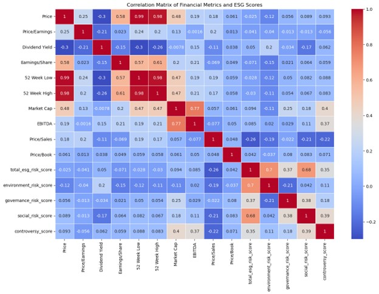
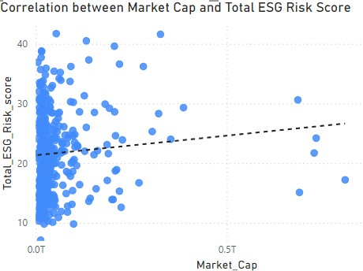
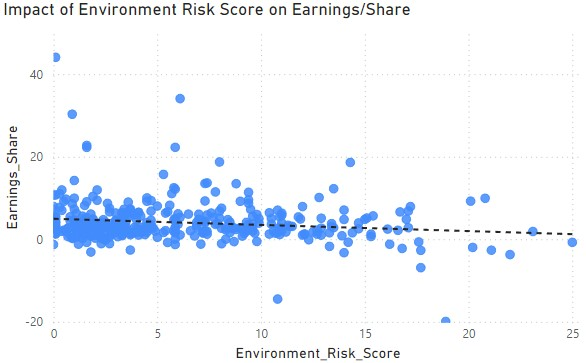
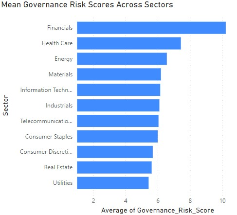
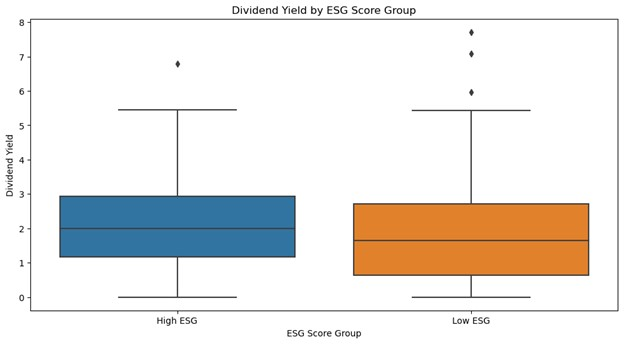
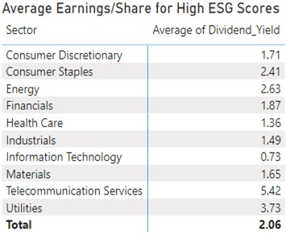
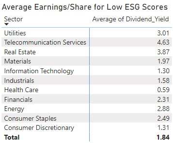

# S&P 500 - ESG Data Analytics Report

## Introduction

This report provides an in-depth analysis of the relationship between ESG (Environmental, Social, and Governance) scores and financial performance metrics of companies listed in the S&P 500. It focuses on understanding the correlations and significant differences across various sectors by leveraging hypothesis testing and visualization techniques.

## Data Overview

- [**S&P 500 Constituents Financials**](https://www.kaggle.com/datasets/zinovadr/sp-500-companies-with-financial-information?select=constituents-financials_csv.csv): Financial metrics of S&P 500 companies.
- [**S&P 500 ESG Risk Ratings**](https://www.kaggle.com/datasets/pritish509/s-and-p-500-esg-risk-ratings): ESG risk ratings for S&P 500 companies.

## Objectives

1. **Correlation Analysis:** Examine the correlation between ESG scores and financial metrics.
2. **Hypothesis Testing:** Test hypotheses regarding the impact of ESG scores on financial performance.
3. **Sector Analysis:** Analyze the average earnings per share (EPS) for companies with high and low ESG scores across different sectors.

## Data Cleaning and Preparation

The data cleaning process involved handling missing values, renaming columns for consistency, and merging the datasets on the common identifier (company symbol).

## Analysis

### Correlation Matrix

Below is the correlation matrix derived from the cleaned data.

### Hypothesis Testing

#### Question 1: Is there a significant correlation between Market Cap and Total ESG Risk Score?

- **Null Hypothesis (H0):** There is no significant correlation between Market Cap and Total ESG Risk Score.
- **Test Used:** Pearson Correlation
- **Results:**
  - Correlation coefficient: 0.094
  - p-value: 0.067
- **Conclusion:** Since the p-value is greater than 0.05, we fail to reject the null hypothesis. There is no significant correlation between Market Cap and Total ESG Risk Score.

#### Question 2: Does the Environment Risk Score have a significant impact on Earnings/Share?

- **Null Hypothesis (H0):** Environment Risk Score has no significant impact on Earnings/Share.
- **Test Used:** Linear Regression
- **Results:**
  - Coefficient for Environment Risk Score: -0.148
  - p-value: 0.003
- **Conclusion:** Since the p-value is less than 0.05, we reject the null hypothesis. The Environment Risk Score has a significant impact on Earnings/Share.

#### Question 3: Are the mean Governance Risk Scores different across different sectors?

- **Null Hypothesis (H0):** The mean Governance Risk Scores are the same across all sectors.
- **Test Used:** ANOVA
- **Results:**
  - F-statistic: 32.52
  - p-value: 6.27e-45
- **Conclusion:** Since the p-value is less than 0.05, we reject the null hypothesis. The mean Governance Risk Scores are different across different sectors.

#### Question 4: Is there a significant difference in Dividend Yield between companies with high and low ESG Risk Percentiles?

- **Null Hypothesis (H0):** There is no significant difference in Dividend Yield between companies with high and low ESG Risk Percentiles.
- **Test Used:** T-test
- **Results:**
  - t-statistic: 2.39
  - p-value: 0.017
- **Conclusion:** Since the p-value is less than 0.05, we reject the null hypothesis. There is a significant difference in Dividend Yield between companies with high and low ESG Risk Percentiles.

### Sector Analysis

The analysis compared the average Earnings per Share (EPS) for companies with high and low ESG scores across various sectors.

## Key Findings

1. **No Significant Correlation:** There is no significant correlation between Market Cap and Total ESG Risk Score.
2. **Significant Impact of Environmental Risk:** The Environment Risk Score significantly correlates with Earnings/Share, indicating that environmental risk factors play a crucial role in financial performance.
3. **Sector Differences in Governance Risk Scores:** Governance Risk Scores vary significantly across different sectors, suggesting sector-specific governance challenges and strengths.
4. **Dividend Yield and ESG Scores:** There is a significant difference in Dividend Yield between companies with high and low ESG Risk Percentiles, indicating that ESG performance can correlate with dividend payouts.
